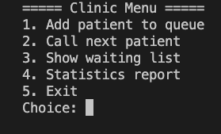
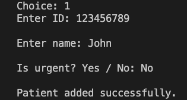
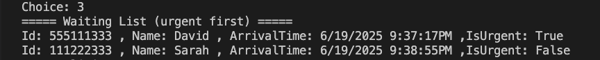
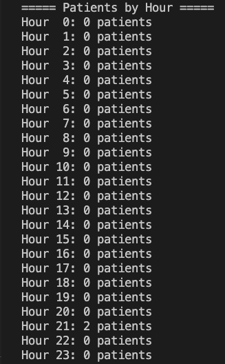

# ClinicQueue – Dual‑Priority Patient Queue Manager

ClinicQueue is a console application that simulates a clinic’s reception desk with *urgent* and *regular* queues. The program tracks hourly statistics.

---

## 🚀 Overview

A minimal console tool that lets receptionists add patients, prioritise urgent cases, and keep simple statistics—all without a database or external dependencies.

---

## 🛠 Tech Stack

* **Language:** C#

---

## 🎯 Features

* ➕ **Add Patient** – Insert a new patient as *urgent* or *regular*.
* 👉 **Call Next Patient** – Always prioritises urgent cases automatically.
* 👀 **View Waiting List** – Shows the full queue without changing its order.
* 📊 **Hourly Statistics** – Counts patients treated per hour (0 – 23).

---

## 🧪 How It Works

1. **Interactive Menu** – The app displays a text‑based menu with five options.
2. **Separate Queues** – Urgent and regular patients are stored in two custom `Queue<T>` instances.
3. **Linked‑List Implementation** – Each queue uses a generic singly‑linked list (`Node<T>`).
4. **Calling a Patient** – `ClinicQueue` always dequeues from the urgent queue first.
5. **Statistics Array** – An `int[24]` array counts handled patients per hour.

---

## 📸 Screenshots

### 📋 Clinic Menu

### ➕ Add Urgent Patient

### ➕ Add NotUrgent Patient

### 🩺 Call Next

### 📄 Waiting List

### 📊 Report

---

## 🔒 Permissions / Safety

* No network or admin permissions are required.
* All data lives in memory for the duration of a run and is reset next launch.

---

## 🙌 Author

Developed by **Leroy Fainberg** to practise C# fundamentals and data‑structure implementation.